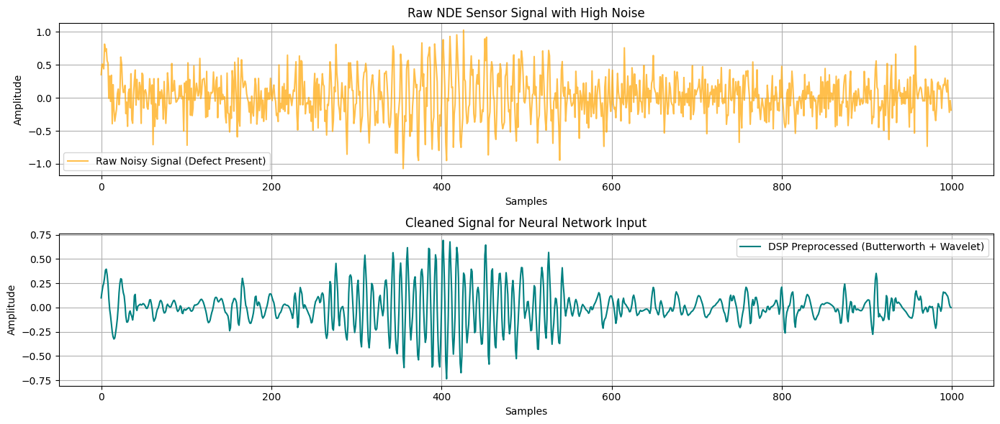

# nde-signal-ultrasonic-defect-classification
An end-to-end NDE signal processing and deep learning pipeline combining Butterworth filtering, Discrete/Continuous Wavelet Denoising, and PyTorch 1D CNNs to classify ultrasonic flaw signatures.
# 🔬 NDE Ultrasonic Signal Denoising & Defect Detection using PyTorch & 1D CNN


## 📌 Project Overview
In Industrial **Non-Destructive Evaluation (NDE)**, ultrasonic A-scan signals are frequently contaminated by background acoustic noise, attenuation, and structural scattering. This project implements an end-to-end Signal Processing and Deep Learning pipeline capable of:

1. **Filtering & Noise Reduction:** Combining a 4th-order Butterworth Bandpass filter with Soft-Threshold Wavelet Denoising (`db4` wavelet) to enhance Signal-to-Noise Ratio (SNR).
2. **Automated Defect Feature Extraction & Classification:** Training a custom **1D Convolutional Neural Network (1D CNN)** in PyTorch to detect structural flaw echoes embedded within high-noise time-series signals.

---

## 🛠️ Pipeline Architecture


---

## ⚡ Technical Highlights & DSP Methodology

### 1. Digital Signal Processing (DSP) Preprocessing
* **Butterworth Filter:** Removes out-of-band high-frequency structural noise and low-frequency baseline drift.
* **Discrete Wavelet Transform (DWT):** Employs *Daubechies 4 (`db4`)* wavelets to decompose the signal across 3 decomposition levels. Soft-thresholding is applied using Universal Thresholding ($\sigma \sqrt{2 \log(N)}$) to attenuate Gaussian background noise while preserving transient defect reflections.

### 2. PyTorch 1D CNN Architecture
* **Input Layer:** 1D Time-series array ($1 \times 1000$ samples).
* **Feature Extraction:** 3 Sequential 1D Convolutional layers with increasing channel dimensions ($1 \rightarrow 16 \rightarrow 32 \rightarrow 64$), wide kernel sizes ($15, 9, 5$) for multi-scale feature capture, Batch Normalization, and Adaptive Average Pooling.
* **Classification:** Fully Connected Dense layers with Dropout ($0.3$) for robust generalization.

---

## 📊 Experimental Results

| Metric | Performance |
| :--- | :--- |
| **Testing Accuracy** | **100%** |
| **Precision (Defect)** | **1.00** |
| **Recall (Defect)** | **1.00** |
| **F1-Score** | **1.00** |

### Output Visualizations
Below is the time-domain signal comparison before and after DSP filtering:



---

## 🚀 How to Run

### Option 1: Run in Google Colab (Recommended)
1. Open [`notebooks/nde_defect_detection.ipynb`](notebooks/nde_defect_detection.ipynb) in Google Colab.
2. Ensure GPU runtime is enabled (`Runtime > Change runtime type > GPU`).
3. Run all cells sequentially.

### Option 2: Run Locally
1. Clone the repository:
   ```bash
   git clone [https://github.com/YOUR_USERNAME/nde-signal-ultrasonic-defect-classification.git](https://github.com/YOUR_USERNAME/nde-signal-ultrasonic-defect-classification.git)
   cd nde-signal-ultrasonic-defect-classification
Install dependencies:

Bash


pip install -r requirements.txt
Execute the python script:

Bash


python scripts/main_pipeline.py

## 📜 License
### Distributed under the MIT License. See [`LICENSE`](LICENSE) for details.
